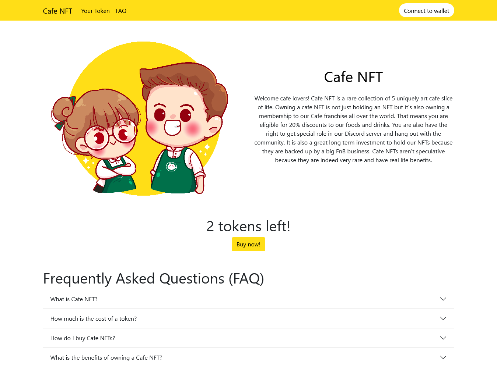
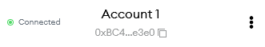
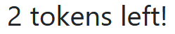
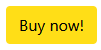
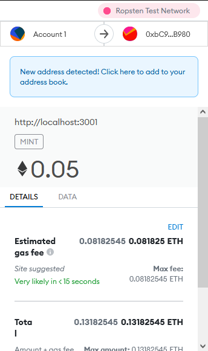
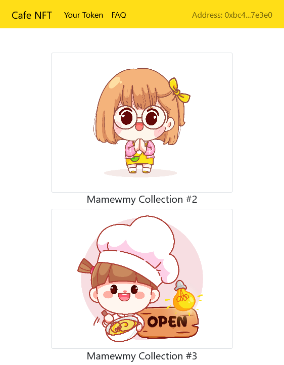

# Cafe NFT dAPP ☕



## Installation

Clone and install the dependencies:
```
git clone git@github.com:stevelukis/cafe-nft.git
cd cafe-nft
yarn add
```

Create a `.env` file and fill it with something like this:
```
REACT_APP_API_URL=YOUR_API_URL
REACT_APP_CONTRACT_ADDRESS=YOUR_CONTRACT_ADDRESS
```

Run it:
```
yarn start
```

## Description

This repo shows an example of a website which is integrated to an ERC721 NFT contracts.

The libraries used in the front end are:

- React.js
- React Router
- React Bootstrap
- Web3.js

## Features

### Connect to wallet


This will trigger a connection between the website and the Metamask plugin. Once done, Metamask will say that it is
connected to the website.



### Number of tokens left



This shows how many tokens are available to buy. What basically this does is get the number of maximum supply and
subtract it with the total supply.

### Buy NFT



This button will create a transaction to the smart contract and sending 0.05 ether.



### Owned NFT



This page shows the user the NFT they already owned. The images are not saved in the web server. They are fetched from
the IPFS the images reside.

## Follow me

[👩‍💻 Github](https://github.com/stevelukis)

[Ⓜ Medium](https://medium.com/@stevelukis)

[💪 Upwork](https://www.upwork.com/freelancers/~0199de1d4d4622e8ae)

[🧧 Fiverr](https://www.fiverr.com/stevelukis)
